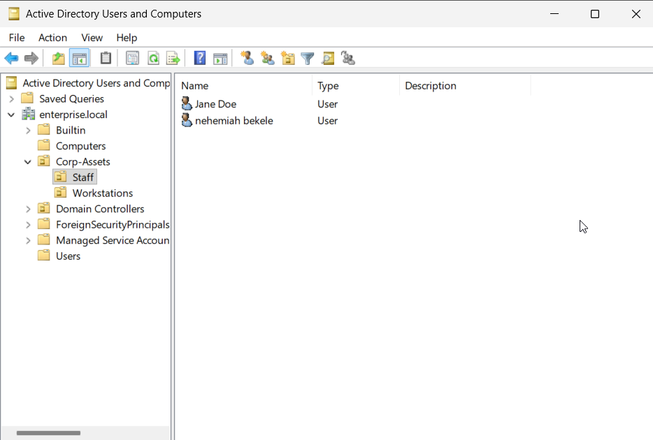

# 🛡️ Enterprise IT Operations & Identity Management Lab

> **Objective:** To bridge the gap between enterprise identity management, service desk operations, and system automation within a unified IT support workflow.

## 📂 Project Roadmap & Master Milestones

### Phase 0: Environment Architecture & Hypervisor Provisioning

- [x] **Hypervisor Sandboxing:** Construct a dedicated, host-isolated virtual network to safely segment enterprise systems from the home network.
    
- [x] **Image Curation:** Gather verified installation media for modern Windows Server and Windows Enterprise client nodes.
    
- [x] **Secret Management:** Implement secure local administration credentials, ensuring zero hardcoded domain passwords exist in deployment scripts.
    

### Phase 1: Identity Infrastructure & Core Directory Services

- [x] **Windows Server Deployment:** Install and promote a graphical Windows Server node to an enterprise Domain Controller (DC).
    
- [x] **Active Directory (AD DS) Configuration:** Initialize a custom local root forest namespace (`enterprise.local`) and configure core internal DNS zoning.
    
- [x] **Network Dominance Allocation:** Establish an internal DHCP scope on the server node to automatically handle client network handshakes and enforce exclusive DNS targeting.
    

### Phase 2: DevOps Automation & Bulk User Provisioning

- [x] **Data Ingestion Preparation:** Ingest a flat-file CSV corporate directory containing multi-departmental records and enterprise job titles.
    
- [x] **User Provisioning Engine:** Leverage a custom Python automation engine to programmatically parse structural database fields into active directory objects.
    
- [x] **Logical Hierarchy Engineering:** Automate the dynamic creation of nested departmental Organizational Units (OUs), security groups, and complex initial credential matrices.
    

### Phase 3: Endpoint Hardening & Enterprise Group Policy

- [x] **Client Domain Join:** Connect a Windows client virtual machine to the corporate domain, validating client-to-DC authentication handshakes.
    
- [x] **Security Policy Implementation:** Design and link a custom Group Policy Object (GPO) to enforce enterprise-grade legal restrictions at the system boundary.
    
- [x] **Policy Enforcement Audit:** Execute structural policy refreshes on target endpoints to verify mandatory compliance changes cascade instantly.
    

### Phase 4: ITSM Ticket Pipeline Integration (Planned)

- [x] **Service Desk Cloud Deployment:** Spin up an enterprise-tier IT Service Management (ITSM) ticketing platform using Jira Service Management Cloud.
    
- [x] **Operational Support Architecture:** Structure specialized support queues (Tier 1 Triage, SysAdmin Escalations) and establish strict Service Level Agreements (SLAs) for tracking incoming system requests.
    

### Phase 5: Incident Simulation & Lifecycle Triage (Planned)

- [x] **Account Lockout Simulation:** Intentionally trigger consecutive authentication failures on the client workstation to simulate a real-world user lockout.
    
- [x] **Ticket Ingestion & Resolution:** Log the incident into the Jira service desk, triage the asset, systematically clear the account block within Active Directory, and formally close out the support ticket with professional internal notes.
    

---
## 🛠️ Laboratory Technical Execution Log

### Phase 0: Environment Architecture & Hypervisor Provisioning

#### **Architectural Context: Cloud vs. Local Hypervisor**

When designing enterprise infrastructure, it is critical to evaluate where workloads live based on compute availability, resource limits, and financial management. This is all usually done by systems engineers, but for this project, the two options were operating in the cloud through an Azure trial or using a localized physical infrastructure. Below is the thought process and data-center realities that eventually led to prioritizing a local over a cloud-based infrastructure.

At first, I had originally planned to use Azure for a completely cloud-based environment. Especially after the completion of my AZ-900 certification, I was excited to put that knowledge to use hands-on and work with Azure some more after testing. I started by creating a dedicated resource group (`rg-enterprise-ops`) and initializing a custom Virtual Network (`vnet-corp-isolated`). Right off the bat, I noticed Azure automatically spawned an extra resource group called `NetworkWatcherRG`. After checking the platform behavior, I realized this wasn't a mistake—it’s an automated backend mechanism where Azure stands up its diagnostic network monitoring tools natively in the background.

However, the realities of shared cloud infrastructure quickly introduced friction. When I attempted to provision a free-tier eligible `Standard_B1s` virtual machine running Windows Server 2025 within the newly created cloud network, the portal threw a persistent `NotAvailableForSubscription` error code. Even after updating the parameters to upgrade the virtual hardware skeleton to newer `Standard_B2ats_v2` shapes and attempting to rotate geographic regions across East US 2, Central US, and West US 2, the regional data centers strictly rejected the compute allocation requests. When I jumped into the subscription's `Usage + quotas` dashboard to diagnose the capacity ceiling, the management API dropped into an indefinite telemetry sync loop.

This friction pointed directly to high-traffic capacity constraints within Azure's public trial pools, compounded by standard synchronization propagation delays common to newly initialized accounts. Because stalling out waiting for an external cloud API to clear would halt laboratory build velocity, I made an executive architectural decision to abandon the cloud layer entirely. I shifted the workloads off Azure and onto a localized, type-2 hypervisor engine running natively on my physical Linux Mint desktop using VirtualBox. This pivot granted me 100% control over hardware resource allocation, eliminated public cloud billing risks, and guaranteed unlimited free runtime for testing.

#### **Sub-task 1: Compute Provisioning & Baseline OS Ingestion**

- **I executed this:** Built a virtual compute container inside VirtualBox named `vm-dc-server2025` with 4 GiB of RAM, 2 vCPU cores, an EFI boot framework, and a 60 GB dynamic VDI storage disk. I mounted the official Windows Server 2025 Evaluation ISO to the virtual optical drive, bound the network interface card directly to an isolated NAT Network segment with hypervisor DHCP services disabled, and initialized the installation wizard.
    
- **This happened:** The environment successfully processed the image setup, but because of the default installation settings, it booted directly into a headless Windows Server Core text environment rather than a graphical desktop, presenting me with the native command-line `SConfig` utility.
    

#### **Sub-task 2: Re-Engineering for Graphical Administration**

- **I executed this:** Executed an immediate hardware reset to clear the text-only environment. I wiped the virtual storage pool, re-allocated the hardware skeleton, and explicitly selected **Windows Server 2025 Datacenter (Desktop Experience)** on the subsequent boot cycle to ensure I had full access to graphical visual administrative snap-ins like Active Directory Users and Computers (ADUC).
    
- **This happened:** The system deployed successfully, dropping me onto a full desktop interface. When the local lock screen required a physical `Ctrl + Alt + Delete` combination that my Linux Mint host-key maps kept intercepting, I bypassed the keyboard conflict by utilizing VirtualBox's native input menu combination (**`Right Ctrl + Delete`**), cleanly authenticating into the local administrator profile.
    

---
### Phase 1: Identity Infrastructure & Core Directory Services

#### **Sub-task 3: Guest Network Conditioning & Static IP Allocation**

- **I executed this:** Invoked the network configuration panel via `ncpa.cpl`, opened the properties of the primary virtual Ethernet adapter, and swapped the system from dynamic address allocation to fixed, hardcoded enterprise parameters. I assigned a Static IP of `10.0.1.10`, a Subnet Mask of `255.255.255.0`, a Default Gateway of `10.0.1.1`, and set the Preferred DNS Server to point back inward to local loopback `127.0.0.1`.
    
- **This happened:** The network adapter successfully locked in the permanent identity settings, ensuring the server would maintain a fixed, predictable presence across the virtual network switch to safely handle upcoming directory lookups.
    

#### **Sub-task 4: Active Directory Role Ingestion & Forest Promotion**

- **I executed this:** Opened Server Manager, ran through the Add Roles and Features Wizard, and checked the box to install **Active Directory Domain Services (AD DS)** along with its required management snap-ins. Once the binaries were cached, I clicked the yellow system notification flag and selected **Promote this server to a domain controller**, configuring the wizard to build a brand-new forest under the root namespace **`enterprise.local`** and establishing a secure Directory Services Restore Mode (DSRM) backup password.
    
- **This happened:** The environment successfully passed all validation checks, bypassed standard external DNS delegation warnings, and completed a forced system reboot. Upon cycling, the Windows lock screen context updated to display **`ENTERPRISE\Administrator`**, proving that the local machine database had successfully transitioned into an active enterprise directory core.
    

  

*The creation of the "enterprise.local" Domain Creation.*

#### **Sub-task 5: Core Network Dominance (DNS & DHCP Infrastructure)**

- **I executed this:** Launched DNS Manager to verify that local Host A lookup records were cleanly mapped. I then right-clicked the server root node, accessed properties, and added Cloudflare's `1.1.1.1` resolver to the **Forwarders** tab to allow safe, recursive external internet resolution. Finally, I returned to Server Manager, added the **DHCP Server** role, authorized the service within Active Directory, and built a new client lease scope named `Scope-Internal-Corp` distributing dynamic addresses from `10.0.1.50` to `10.0.1.200` with the Default Gateway mapped to `10.0.1.1` and DNS mapped directly to our DC at `10.0.1.10`.
    
- **This happened:** The DHCP scope turned on with an active green status checkmark, successfully positioning our Domain Controller as the absolute authority for network address distribution and name resolution across the entire network layer.
    

#### **Sub-task 6: Provisioning and Deploying the Client Endpoint**

- **I executed this:** Provisioned an independent virtual desktop skeleton named `vm-w10-client01` inside VirtualBox, specifying 1.5 GiB of RAM, 2 vCPUs, and a 50 GB VDI storage drive. I mounted the official `Windows_10_Enterprise_Eval.iso`, attached its network card to our isolated NAT Network segment, and initiated VirtualBox's Unattended Guest Installation engine to automatically process the OOBE routines.
    
- **This happened:** The workstation automated setup finished cleanly, dropping me onto a live, functional local administrative profile.
    

#### **Sub-task 7: Executing the Domain Join**

- **I executed this:** Logged into the client workstation, opened a command line to verify that it had successfully pulled a corporate dynamic lease address of `10.0.1.51` from the server, and invoked `sysdm.cpl`. I changed the workstation's hostname to the standardized asset tag **`CL-HR-01`**, targeted the root domain directory at **`enterprise.local`**, and authenticated using my `ENTERPRISE\Administrator` credentials.
    
- **This happened:** The endpoint successfully passed its credentials to our Domain Controller, written its machine object into the central directory schema, and prompted for a system reboot to apply changes.
    

#### **Sub-task 8: Logical Directory Engineering & User Provisioning**

- **I executed this:** Opened Active Directory Users and Computers (ADUC) on the server and built a top-level root Organizational Unit (OU) container named **`Corp-Assets`**. Inside it, I built two nested sub-OUs: **`Staff`** (to store employee accounts) and **`Workstations`** (to store machine assets), and dragged the `CL-HR-01` computer object out of the default legacy folder into the new `Workstations` OU. I then manually provisioned a baseline worker account for Jane Doe (`jdoe`) set to change password at next logon, and built a dedicated helpdesk admin account under my own name (`yourname-admin`) configured with a non-expiring password.
    
- **This happened:** The directory structure organized cleanly, mapping out a distinct corporate asset hierarchy.
    

  

*User "jdoe" workstation CL-HR-01. **Right window**: "jdoe" Workstation. **Left window**: Workstation visible from Active Directory.*

  

*User account creation for admin and jdoe user.*

#### **Sub-task 9: Administrative Escalation & User Verification**

- **I executed this:** Accessed the security properties of my personal `yourname-admin` user account object within ADUC, opened the **Member Of** tab, and added the profile directly to the **`Domain Admins`** security group. I then jumped over to workstation `CL-HR-01` and logged in as the standard user `jdoe`.
    
- **This happened:** My personal admin profile successfully inherited full administrative keys over the forest. On the client workstation, the user profile successfully initialized its encrypted local file folders and accepted an initial password rotation to `EnterpriseUser1!`.
    

  

*Admin account configuration.*

#### **Sub-task 10: Group Policy Object Enforcement & Forced Inheritance**

- **I executed this:** Opened the Group Policy Management Console (GPMC) on the Domain Controller, right-clicked our top-level `Corp-Assets` OU, and selected _Create a GPO in this domain, and Link it here..._, naming the object **`GPO-Corp-SecurityPolicy`**. I right-clicked the policy, entered the editor, navigated to `Computer Configuration -> Policies -> Windows Settings -> Security Settings -> Local Policies -> Security Options`, and configured the interactive logon text nodes with an explicit corporate warning title and banner text. Finally, I switched to workstation `CL-HR-01` and ran `gpupdate /force` in an administrative terminal.
    
- **This happened:** The endpoint successfully pulled the security configurations from the server. To validate enforcement, I triggered a system sign-out; upon returning to the lock screen, the mandatory **`UNAUTHORIZED ACCESS WARNING`** legal banner successfully seized control of the interface, completely blocking login access until explicitly accepted.
    

  

*Example of warning message shown in enterprise domain accounts. **Right window**: VM for enterprise domain. **Left window**: Interactive Logon settings from Domain Controller.*

#### **Phase 1 Technical Hurdles & Engineering Evolution**

As the baseline identity infrastructure crystallized, navigating the virtualization boundaries introduced critical troubleshooting moments. During initial server staging, File Explorer hid the `.exe` extension on the hypervisor's guest additions installer because Windows Server defaults to masking known file extensions. I exposed the true strings globally by navigating to `View -> Show -> File name extensions`, but ultimately bypassed the additions install to preserve lab velocity, relying instead on VirtualBox's native mouse integration.

The most severe hurdle surfaced during endpoint provisioning when severe host laptop resource exhaustion caused the Windows 10 client machine to drop completely into an autoconfigured **APIPA** address space (`169.254.X.X`). This network drop occurred because the heavy Windows Server node was powered down during initial client booting, leaving the virtual switch without an active DHCP provider. I executed a hard physical shutdown of both guests to flush the hypervisor ARP tables, downscaled the Server memory footprint to 2 GiB, and allocated 1.5 GiB to the Client.

When the Server rebooted under this lighter profile, its interface unexpectedly abandoned its static parameters and pulled a dynamic pool address instead. I jumped back into `ncpa.cpl` on the server, re-enforced our strict static parameters (`10.0.1.10`), and unmapped an inactive IPv6 block. Full sub-1ms ping connectivity and recursive DNS lookups instantly stabilized across the isolated switch link, clearing the path for the successful domain join and GPO enforcement.

---
### Phase 2: DevOps Automation & Bulk User Provisioning
#### **Sub-task 11: Creating the Fictional Corporate Directory Dataset**

- **I executed this:** I created a dedicated local automation staging directory at `C:\lab-automation\` directly inside my Domain Controller's file system. Within that folder, I used Notepad to manually build a flat-file database named `employees.csv` populated with a multi-departmental corporate roster of 21 unique rows, explicitly mapping out structural data headers for `Firstname`, `Lastname`, `Department`, and `JobTitle`.
    
- **This happened:** The environment now possessed a structured, clean data ingestion source. To make the directory feel like a realistic, enterprise-scale dataset for an onlooker, I populated it with built-in nods to iconic fictional leaders across various operational units—placing Tony Stark in Engineering, Bruce Wayne in Executive, Sarah Conner in DevOps, and Fox Mulder auditing system logs in IT.
    

#### **Sub-task 12: Authoring the Python Provisioning Engine**

- **I executed this:** Using Notepad inside the staging folder, I authored a procedural script named `ad_provision.py`. I coded the engine to read our CSV database, utilize a dynamic string `set()` array to track department names on the fly so it wouldn't create duplicate directory objects, and programmatically map employee initials to standardize user logon names (e.g., Marcus Vance automatically parsed to `mvance`). I also structured it to auto-generate temporary credentials that satisfied Active Directory's complex security requirements (e.g., `InitMvva2026!`).
    
- **This happened:** The Python script ran smoothly in a fraction of a second, successfully parsing the raw strings from the CSV file and exporting a massive, compiled deployment script named `deploy_users.ps1` filled with native Active Directory PowerShell commands.
    

#### **Sub-task 13: Executing the Automation Payload & Directory Validation**

- **I executed this:** Opened an elevated Windows PowerShell console as an Administrator, changed directories into `C:\lab-automation\`, and overrode the native script-signing blocks by executing `Set-ExecutionPolicy Bypass -Scope Process -Force`. I then executed the compiled automation payload using the command `.\deploy_users.ps1`.
    
- **This happened:** The payload communicated flawlessly with the Active Directory Domain Services (AD DS) API layer. The terminal quickly looped through the records, automatically carved out brand-new nested Organizational Units (OUs) under the `Staff` directory for `IT`, `Engineering`, `Security`, `Finance`, `Logistics`, `Executive`, `Marketing`, and `Research`, and cleanly provisioned all 21 employees directly into their correct departmental buckets with their proper corporate titles pre-mapped.
    
- **Validation Check:** I launched the Active Directory Users and Computers (ADUC) snap-in and triggered a refresh. The empty directory tree instantly transformed into a dense, beautifully structured, enterprise-populated ecosystem.
    

  

*Results of the automated user provisioning process in Active Directory. **Bottom Left**: Document with user information. **Top Left**: Terminal for executing code. **Right Side**: Result of new user additions in Active directory.*
#### **Phase 2 Technical Hurdles & Engineering Evolution**

Transitioning from standard infrastructure setup into programmatic automation introduced two massive, unexpected troubleshooting sequences that tested the limits of the virtualization space. The first friction point occurred immediately after setting up the scripts, when attempting to run the compilation via the standard `python` keyword. The Windows command line intercepted the execution with a system error stating that Python was not found, attempting to force a redirect to the Microsoft Store. This happened because Windows Server ships with built-in "App Execution Aliases" designed to catch unmapped commands. Since this was a localized lab environment, the system's global environment path variables (the PATH) had not been cleanly updated to point to the newly downloaded Python binary executable.

Rather than wasting momentum clicking through deep system advanced settings menus to alter app execution aliases, I opened an administrative PowerShell console and executed a single-line network deployment command to silently pull the official stable installer directly from Python's web servers, passing the quiet and `PrependPath=1` parameters. This administrative bypass forced the Windows guest kernel to hardcode the proper environment variables globally, permanently clearing the Microsoft Store shortcut conflict and allowing the universal `python` command to run scripts flawlessly across any terminal session.

With the runtime stabilized, a second and much more exhausting roadblock emerged when trying to actually move my written Python code and CSV files across the boundary from my physical Linux Mint host desktop down into the isolated Windows Server guest virtual machine. VirtualBox strictly refused to enumerate my physical USB flash drives due to secure host-level hardware kernel restrictions, and the hypervisor's native bidirectional shared clipboard and drag-and-drop drivers completely failed to synchronize across the OS boundary.

Instead of burning hours troubleshooting complex Linux kernel hardware groups, editing `vboxusers` permissions, or reinstalling hypervisor extension packs, I decided to prioritize project velocity and engineered a highly creative, out-of-the-box shortcut. Recognizing that my virtual machine had internet access to pull down updates, I opened Microsoft Edge directly inside the running Windows Server VM, securely authenticated into my active cloud service over the public internet, and simply copied the script text blocks straight out of the cloud interface into my local staging directory. This manual bypass highlighted a vital engineering lesson: finding an immediate, secure path of least resistance to route around a strict hardware constraint is often the mark of a highly adaptable technician.

---
### Phase 3: Endpoint Hardening & Enterprise Group Policy

#### **Sub-task 14: Client Domain Join Integration**

- **I executed this:** Logged back into the client workstation, opened an administrative command terminal to verify that its virtual interface card had cleanly pulled a corporate network lease address (`10.0.1.51`) from our active Domain Controller, and invoked the system properties manager via `sysdm.cpl`. I permanently altered the workstation's hostname to follow enterprise asset tracking rules, naming it **`CL-HR-01`**, targeted its joining membership container directly to the root forest directory at **`enterprise.local`**, and authenticated the administrative handshake using my core `ENTERPRISE\Administrator` credentials.
    
- **This happened:** The workstation successfully verified the domain identity, established a secure machine-account relationship within the central directory schema, and prompted for a mandatory system reboot to initialize the change.
    

#### **Sub-task 15: Structural Asset Organization & Escalation**

- **I executed this:** Returned to the Domain Controller and opened Active Directory Users and Computers (ADUC). I built a top-level administrative Organizational Unit (OU) container named **`Corp-Assets`**, and carved out two internal, nested sub-OUs named **`Staff`** (to handle our workforce identity objects) and **`Workstations`** (to house physical endpoints). I then dragged the newly created `CL-HR-01` computer object out of the default legacy folder and dropped it cleanly into the structured `Workstations` OU. Finally, I accessed the security parameters of my personal admin account (`yourname-admin`) and added it directly to the **`Domain Admins`** security group.
    
- **This happened:** The identity layer successfully locked down a predictable, professional asset hierarchy. My personal administrative account instantly inherited full domain-wide traversal keys, allowing me to safely log into the `CL-HR-01` client workstation as a domain controller delegate and verify that user profiles were initializing with proper local folder protections.
    

#### **Sub-task 16: Group Policy Object Architecture & Forced Enforcement**

- **I executed this:** Opened the Group Policy Management Console (GPMC) on the server, right-clicked our master `Corp-Assets` OU, and created a new linked policy object named **`GPO-Corp-SecurityPolicy`**. I entered the policy's management editor and drilled down into the kernel security tree via `Computer Configuration -> Policies -> Windows Settings -> Security Settings -> Local Policies -> Security Options`. I localized the interactive logon policies, creating a customized legal notification banner and warning title. I then returned to the client workstation, opened a command window, and forced an immediate registry synchronization using the command `gpupdate /force`.
    
- **This happened:** The client endpoint successfully parsed the new policy configurations directly from the Domain Controller's SYSVOL share. To visually validate the hardening script, I triggered a global system sign-out. Upon returning to the graphical lock screen interface, the mandatory corporate warning banner successfully seized control of the background window, locking the computer and requiring an explicit user acknowledgement before displaying the login credentials field.
    

#### **Phase 3 Technical Hurdles & Operational Adjustments**

Bringing the independent workstation endpoint online and mapping out global security group policies exposed critical data-center resource limits that forced immediate hardware re-engineering. During initial deployment, the host laptop ran completely out of hardware RAM, causing the client virtual machine to drop its network connection and default to a useless, self-generated **APIPA** address space (`169.254.X.X`). Because the heavy Windows Server instance was starving the virtual switch of compute power during the client's boot cycle, the endpoint could not establish a baseline DHCP handshake.

To resolve this bottleneck and protect my laptop from crashing, I performed a hard physical shutdown of both virtual systems to completely flush the hypervisor's virtual MAC tables. I downscaled the Windows Server memory allocation from 4 GiB to a lightweight 2 GiB, while allocating 1.5 GiB to the Windows 10 workstation. When the Domain Controller booted back up under this lighter profile, its virtual interface card unexpectedly abandoned its fixed settings and pulled a random dynamic address from the hypervisor.

Recognizing that an unstable Domain Controller IP would instantly break all internal domain name lookups and cause the workstation to throw _"Active Directory Domain Controller could not be contacted"_ timeout errors, I jumped straight back into the server's network configuration stack via `ncpa.cpl`. I re-enforced our strict static parameters (`10.0.1.10`), completely unmapped an unutilized IPv6 properties block, and restarted the core active services. Full, sub-1ms ping connectivity and recursive DNS zone forwarding instantly stabilized across the isolated network bridge, clearing the pathway for a successful domain join and seamless Group Policy propagation.

---
### Phase 4: ITSM Ticket Pipeline Integration

#### **Sub-task 16: Deploying the Cloud Helpdesk Command Center**
* **I executed this:** Navigated to the official Atlassian cloud deployment interface using the native web browser on my physical Linux Mint host. I initiated a free tier instance of **Jira Service Management**, registering a dedicated corporate service desk namespace matching our lab's domain structure: `enterprise-local-helpdesk.atlassian.net`. To maintain optimal project velocity and bypass premium trial paywalls, I strategically selected the **Basic IT Service Management** deployment skeleton and initialized the project space under the unified workspace title: **`Enterprise IT & Security Operations`** (assigned the unique, resume-grade tracking key **`EIT`**).
* **This happened:** The cloud instance initialized an enterprise-grade service portal. The platform automatically built underlying ITIL-aligned telemetry data buckets, generating dedicated workflow queues for *Service Requests, Incidents, Problems,* and *Changes*.

#### **Sub-task 17: Engineering the Custom Request Catalog**
* **I executed this:** Drilled down into the project settings using direct URL pathing manipulation (`/settings/request-types`) to bypass dynamic cloud interface menu updates. I customized the default customer portal layout by creating three clean, highly visible operational **Portal Groups** tailored to our Active Directory infrastructure footprint: 🖥️ *Hardware & Endpoint Management*, 🔑 *Identity & Access Control*, and 🛡️ *Security Operations (SOC) Intake*. Within these groups, I mapped out specific request types, creating custom descriptions for **`Account Lockout Remediation`** and **`Local System Issue / Firewall Bypass`**, while adding a **`Suspected Phishing Escalation`** pipeline to showcase security analyst intake workflows.
* **This happened:** The generic out-of-the-box template was successfully hardened into a customized, professional corporate ingestion intake portal, explicitly ready to handle identity blocks and security escalations.

#### **Sub-task 18: Customer Directory Database Synchronization**
* **I executed this:** Opened the Jira Customer Management panel and manually registered a baseline group of testing identities matching the programmatic schema of my local `employees.csv` directory dataset (including `tstark@enterprise.local` and `sconner@enterprise.local`).
* **This happened:** Jira successfully staged the accounts within the service database. Because these accounts utilize our custom internal domain namespace, the platform flagged them as "invited / unverified" portal-only identities. This perfectly simulates an enterprise deployment scenario, allowing me as the administrator to seamlessly open, track, and process live tickets *on behalf of* employees before they ever log into the portal.

  

*The Jira portal, where tickets are submitted.*

---

### Phase 5: Incident Simulation & Helpdesk Lifecycle

#### **Sub-task 19: Group Policy Threat Threshold Engineering**
* **I executed this:** Launched the Group Policy Management Console (GPMC) on the Domain Controller, navigated to the root tree domain container, and opened the advanced **Group Policy Management Editor** interface for the *Default Domain Policy*. I drilled down into the kernel security settings hierarchy (`Computer Configuration -> Policies -> Windows Settings -> Security Settings -> Account Policies -> Account Lockout Policy`) and modified the **Account lockout threshold** property—explicitly shifting it from zero to **`5` invalid logon attempts**, allowing the domain controller to automatically calculate standardized 30-minute security lockout durations.
* **This happened:** The central directory security layer officially activated active brute-force defense tracking. Rather than using standard manual refresh strings, I chose to completely power-cycle and reboot both the Domain Controller and the Windows 10 Workstation endpoints to cleanly flush the virtual system registries and force a deep, native initialization of the updated security update profiles.

  

*The configured lockout policy.*

  

*The configured lockout policy in use on enterprise user account.*
#### **Sub-task 20: Simulating the Boundary Authentication Block**
* **I executed this:** Navigated to the physical login terminal of the isolated `CL-HR-01` workstation container. Utilizing the "Other User" domain account targeting field, I input the automated corporate username for Tony Stark (`tstark`) and intentionally inputted sequential strings of invalid, randomized password characters to test the boundary thresholds.
* **This happened:** Upon reaching the exact 5th consecutive authentication failure, the Windows workstation kernel immediately suspended localized interactive login traffic for the account. The loading dial terminated, and the lock screen interface threw the strict enterprise security warning banner: *"The referenced account is currently locked out and may not be logged on to."*

#### **Sub-task 21: Incident Ingestion & Active Directory Remediation**
* **I executed this:** Accessed my cloud-hosted *Enterprise IT & Security Operations* Jira Service Management dashboard interface as an active administrator. I manually opened an operational intake ticket on behalf of the locked employee, tracking it as **`EIT-1`** under the custom **`Account Lockout Remediation`** request type, and officially assigned the ticket to my analyst profile (`nehemiahb-admin`) while moving the tracker status to *In Progress*. Next, I jumped onto the active Domain Controller, opened Active Directory Users and Computers (ADUC), localized Tony Stark's object profile within the `Engineering` OU properties, navigated to the Account tab, and checked the administrative bypass box to **Unlock Account**.
* **This happened:** The local domain controller instantly cleared the frozen security token. I returned to the physical client workstation interface and inputted Tony Stark's valid script-generated credentials (`InitTost2026!`). The workstation accepted the handshake immediately, bypassing the lockout screen and seamlessly initializing Tony Stark's profile desktop interface for the very first time.
* **Resolution Closure:** I returned to the Jira Cloud interface, logged a comprehensive internal engineering resolution summary into the incident log history, cleared the validation blocks, and officially transitioned ticket `EIT-1` to a status of **Resolved/Done**.

> **Operational Realization:** _I was incredibly surprised by the simplicity of the actual ticketing lifecycle. Building this lab taught me that while constructing the underlying directory services, network routing, and group policies requires intensive engineering logic, actually resolving day-to-day helpdesk incidents is incredibly smooth and straightforward once your infrastructure is configured properly._

  

*The made ticket submitted in Jira.*

  

*Process of resolving the account lockout.*

  

*Resolving the ticket.*

---

## 📝 Lessons Learned

* **The Reality of Setup vs. Operations:** This project highlighted that the vast majority of technical friction lives in initial environment configuration and policy engineering. Once Group Policies and database schemas are properly locked down, daily operations like password resets and account lockouts become repeatable, systematic wins.
* **The Importance of Local Control:** Pivoting from Azure to a localized Type-2 VirtualBox hypervisor reinforced the value of resource management. Managing my own host-isolated network segment gave me direct visibility into DHCP lease pools and DNS loopbacks without cloud propagation latency or API budget blind spots.
* **Policy Auditing and Persistence:** Troubleshooting why accounts wouldn't lock out initially highlighted that operating systems do exactly what they are told to do, not what you *expect* them to do. Turning on thresholds via the Default Domain Policy and forcing registry reloads via cold reboots cemented my understanding of how domain policies actively cascade down to endpoints.

---

## 🚀 The Next Horizon

With a fully functioning corporate directory infrastructure and cloud ticketing intake system firmly established, my future roadmap objectives for expanding this laboratory ecosystem include:

* **SIEM Telemetry Ingestion (Splunk Integration):** My immediate next goal is to bridge this infrastructure over to my SOC Analyst project. I plan to deploy the Splunk Universal Forwarder onto the Windows Server Domain Controller to capture Active Directory Security Event Logs (such as **Event ID 4740** for account lockouts and **Event ID 4625** for failed logons) and parse them into live security dashboards.
* **Hybrid Cloud Expansion (Azure Arc Connection):** To continue building upon my AZ-900 cloud training, I want to integrate Microsoft Azure back into the mix by linking this local on-premise VirtualBox laboratory to the cloud via Azure Arc, allowing for hybrid asset monitoring and identity management from a single cloud pane glass.
* **Automated Threat Escalation (Webhook Triggering):** Developing an automation script that watches the Domain Controller for account lockout events and automatically leverages Jira APIs/Webhooks to auto-generate a high-priority `EIT` triage ticket the exact second a real-world user gets blocked at the network boundary.