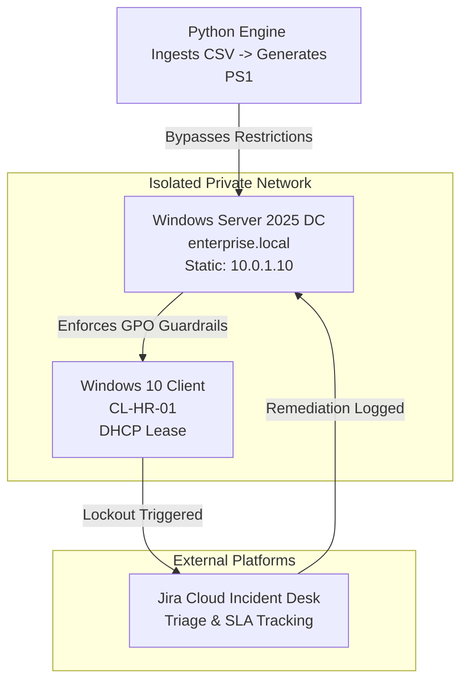

# 🛡️ Enterprise IT Operations & Identity Management Ecosystem

**Goal:** Automate enterprise user identity provisioning using a custom Python-to-PowerShell engine, establish a secure Windows Server 2025 Active Directory domain, and link a cloud-hosted Jira Service Desk pipeline for real-world security remediation.

---
## 🧭 Project Phases

This lab follows an engineering-first approach to infrastructure automation and identity management:

- **Phase 1:** Core Infrastructure (Windows Server 2025, Static IP, DNS & DHCP Scopes)
- **Phase 2:** DevOps Automation (Python-parsed CSV dataset generating native PowerShell deployment payloads)
- **Phase 3:** Fleet Endpoint Integration (Windows 10 Enterprise machine-account domain handshakes)
- **Phase 4:** ITSM Cloud Pipeline (Configuring ITIL-aligned service queues and SLAs within Jira Cloud)
- **Phase 5:** Security Remediation (GPO lockout threshold validation and live service desk triage)

---
## 🔍 Guiding Questions

- How do domain-wide Group Policy Objects cascading to endpoints protect local systems against active boundary brute-force sequences?
- Can automation completely eliminate manual identity management inaccuracies during bulk corporate onboarding?
- Can a cloud-hosted ITSM platform reliably track and audit internal system remediation metrics?

---
## 🛠️ Tools Used

- **Python 3 / CSV Parsing:** Data normalization and programmatic payload scripting.
- **PowerShell (ActiveDirectory Module):** Automated Directory administration and execution.
- **Windows Server 2025 Datacenter:** Domain Controller (DC) hosting AD DS, DNS, and DHCP.
- **Windows 10 Enterprise:** Fleet endpoint workstation node.
- **Jira Service Management Cloud:** Cloud-hosted enterprise ticketing and SLA tracking.
- **VirtualBox Hypervisor:** Secure, host-isolated private NAT networking sandbox.

---
## 📸 Examples Images from Lab

<p align="center">
  
</p>
*The creation of the "enterprise.local" Domain Creation.*

<p align="center">
  
</p>
*Results of the automated user provisioning process in Active Directory. **Bottom Left**: Document with user information. **Top Left**: Terminal for executing code. **Right Side**: Result of new user additions in Active directory.*

<p align="center">
  
</p>
*The configured lockout policy in use on enterprise user account.*

<p align="center">
  
</p>
*The made ticket submitted in Jira.*

---
## 📂 System Architecture

### 1. Dynamic Flowchart 



---
## 🚀 Getting Started & Replicating the Lab

If you want to download and test these automation tools in your own environment, all the necessary deployment files are included right here in this repository. 

### 📂 File Guide
* **`employees.csv`**: This is the flat-file database where you can add, remove, or modify your fictional corporate roster and department job titles before initiating the automation engine.
* **`ad_provision.py`**: The core Python script responsible for parsing the CSV database, handling data normalization, string manipulation, and dynamically compiling the native Active Directory user objects.

### ⚙️ How to Run the Provisioning Engine

To run the automated deployment script on your active Windows Server Domain Controller and bypass default script-signing restrictions, copy and paste the execution block below into an elevated PowerShell console:

```powershell
Set-ExecutionPolicy Bypass -Scope Process -Force
.\deploy_users.ps1
```

---

## 📝 Key Learning Outcomes

- Scalability Over Repetition: Building accounts manually in Active Directory (ADUC) is an operational bottleneck. Embracing a DevOps approach using code shifts an administrator's focus from repetitive entry work to architectural engineering.

- Centralized Security Enforcement: Linking network endpoints directly to centralized Group Policy domains guarantees security uniformity. If a system baseline isn't managed centrally, it leaves structural visibility gaps across the entire business.

- Pivoting Under Resource Constraints: Overcoming unexpected public cloud capacity limits (NotAvailableForSubscription) by successfully engineering a localized, host-isolated network sandbox proved that resource constraints are simply opportunities to deepen underlying networking and infrastructure knowledge.
